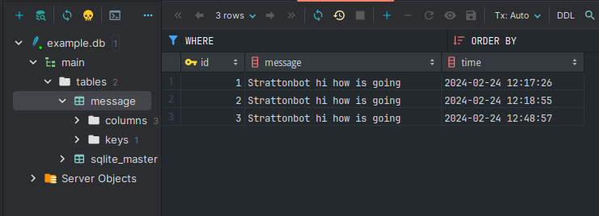

### Test task for Strattonbot internship.

### describes

clone rep:
```bash
 git clone git@github.com:AxmetES/internship_strattonbot.git
 ```

install requirements:
```bash
python3 -m venv venv
```
```bash
source venv/bin/activate
```
```bash
pip install -r requirements.txt
```
### examples
```.env
STMP_USERNAME=your gmail
STMP_PASSWORD=your password
BOT_TOKEN=your bot token
```
### start
For generate xlsx file and send its by email:
```bash
python3 send_email.py
```
file xlsx will generated in ```/Documents/skcu```.

### start tg bot
For start work tg bot:
```bash
python3 tg_bot.py
```
if ```Strattonbot``` in telegram message it will be saved in SQLite DB.

